# 1 方向

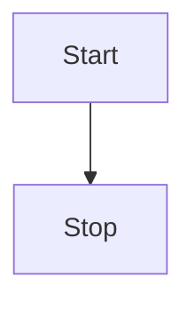
```
graph TD
    Start --> Stop
```
这里的TD指定方向，可选值与其含义有
+ TB / TD：从上到下
+ BT：从下到上
+ RL：从右到左
+ LR：从左到右

# 2 形状
## 2.1 基础形状
普通节点形状，如下
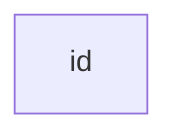


定义一个节点变量：变量名[填充的文字]，如下
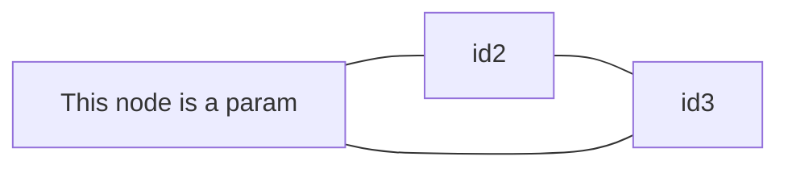
## 2.2 其他形状
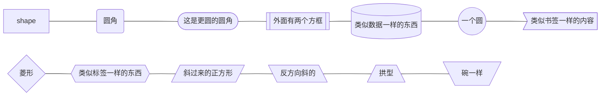
## 2.3 样式
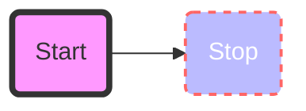
其中的参数解释：
+ fill：填充颜色
+ stroke：边框颜色
+ stroke-width：边宽
+ stroke-dasharray：交替的长度

或者也可以使用下面的形式来使用样式：
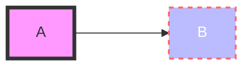

# 3 链接
## 3.1 链接种类
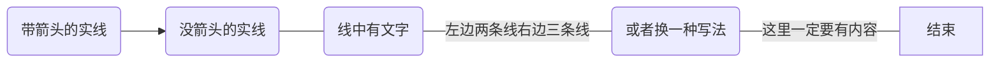
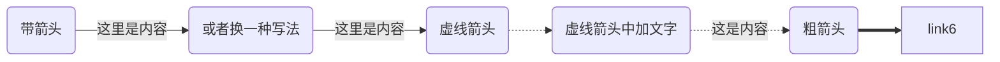
## 3.2 箭头种类
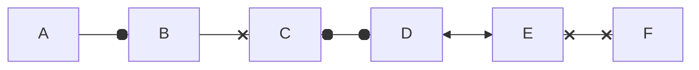
注意，这里不再是graph，而是flowchart。

## 3.3 分支
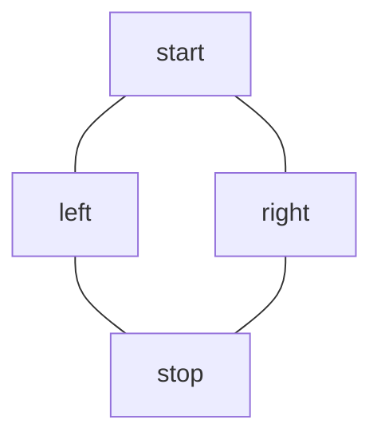
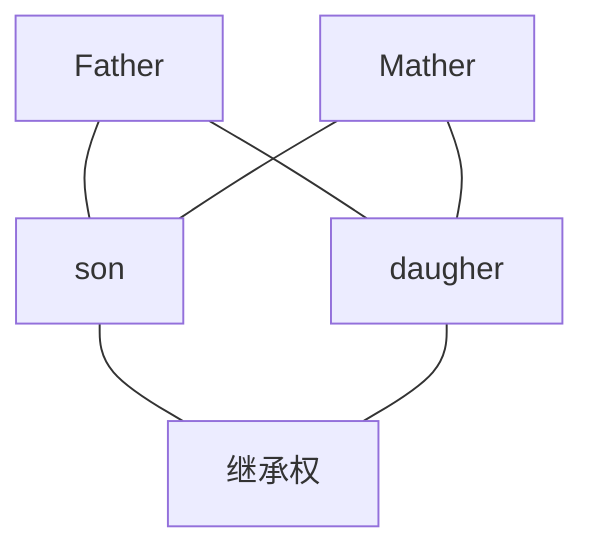
## 3.4 新的单独分支
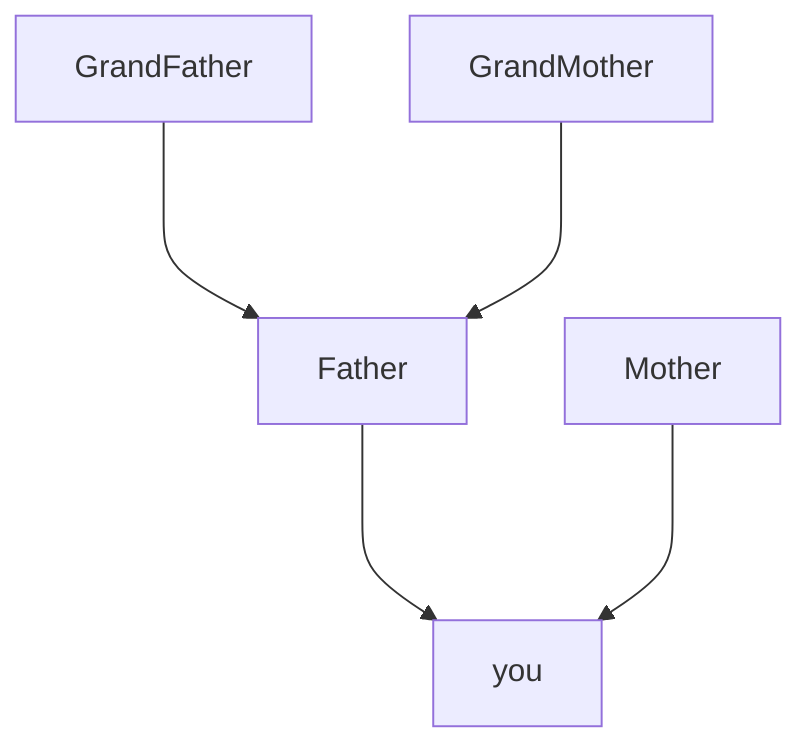

## 3.5 新的单独分支
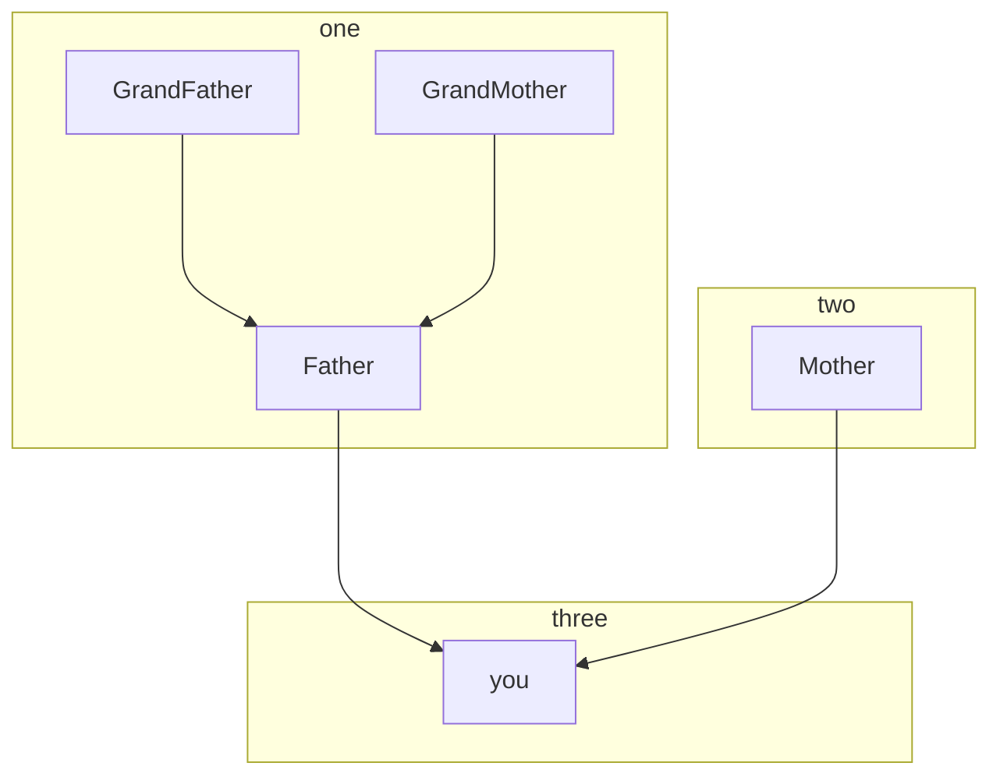
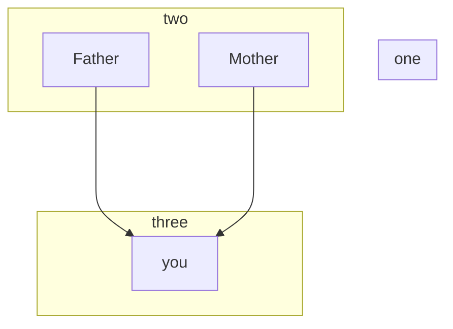

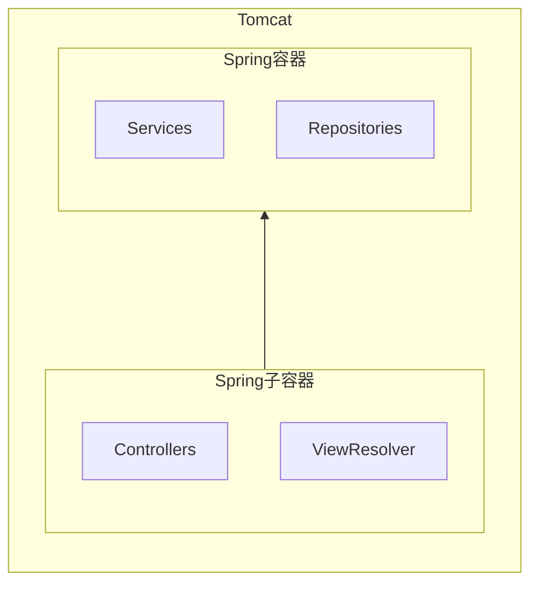
